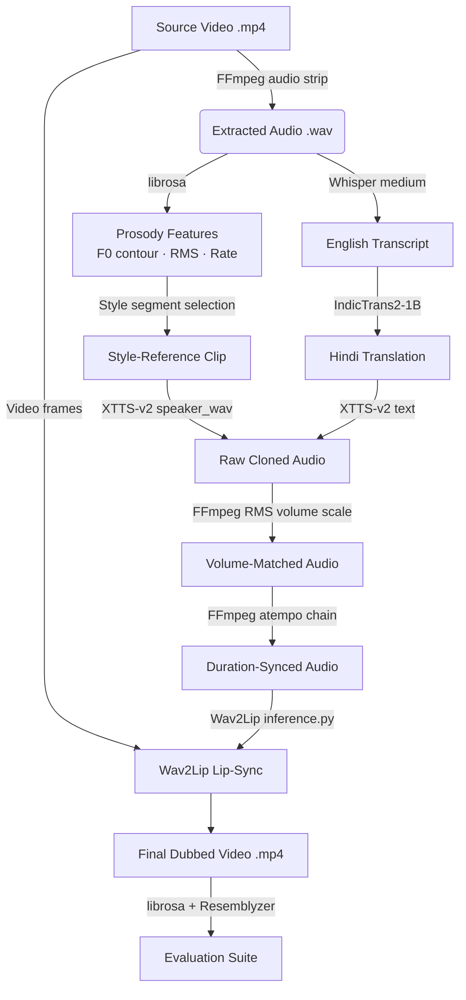
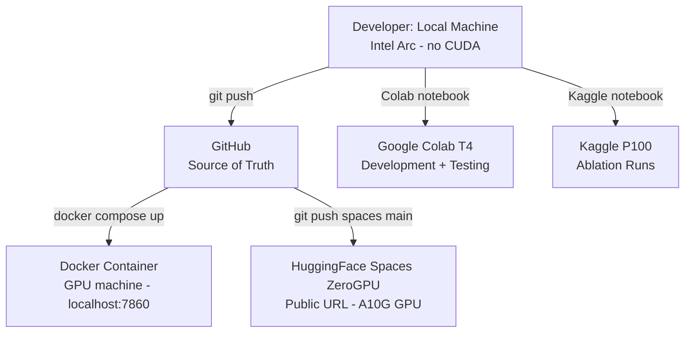

# Resonova — वाणी | System Architecture

> **Emotion-Preserving AI Video Dubbing Pipeline**
> Applied AI & Intelligent Systems | Built June–July 2026

---

## 1. What Resonova Does

Resonova takes a video of a person speaking English and produces a Hindi dubbed version
in that speaker's own cloned voice — with lip movements re-synced and the original
emotional delivery preserved. Upload a 30–90 second clip; get back the same person,
the same energy, a different language. It runs entirely on open-weight models with
no paid APIs, fits on a free-tier T4 GPU (15 GB VRAM), and is deployable via a
single `docker compose up` command.

---

## 2. What Makes Resonova Different

- **Prosody-preservation conditioning layer** — pitch (F0), RMS energy, and speaking
  rate extracted from the original clip are used to select a style-reference segment
  for XTTS-v2, then RMS volume is matched post-synthesis. The dubbed voice sounds
  emotionally consistent with the original, not robotically flat.

- **Evaluation on public benchmarks with real numbers** — 80% emotion preservation
  on RAVDESS, BLEU 0.5120 on FLORES-200 (beating the published IndicTrans2 baseline
  of 0.4930), and 86.5% speaker similarity via Resemblyzer, validated with an ablation
  study showing +40pp SER improvement when conditioning is enabled.

- **End-to-end production-grade integration** — four large models fitted sequentially
  into 15 GB VRAM via load-on-demand lifecycle, checkpoint-resumption for Colab session
  recovery, and 75+ unit tests with 6 Architecture Decision Records.

---

## 3. Full Pipeline Architecture



---

## 4. Stage-by-Stage Breakdown

| Stage | Component | Technology | Role | VRAM |
|-------|-----------|------------|------|------|
| 1 | Audio Extraction | FFmpeg | Strip mono 16 kHz WAV from source video | CPU |
| 2 | Speech-to-Text (ASR) | Whisper `medium` | Transcribe English speech to text | ~1.5 GB |
| 3 | Neural Machine Translation | IndicTrans2-1B | Translate English → Hindi (Devanagari) | ~4.0 GB |
| 4 | Prosody Extraction | librosa | Extract F0 pitch contours, RMS energy, speaking rate, pause ratios | CPU |
| 5 | Voice Cloning + Emotion Conditioning | XTTS-v2 | Zero-shot Hindi synthesis in original speaker's voice, style-conditioned | ~4.5 GB |
| 6 | Audio Synchronisation | FFmpeg `atempo` chains | Stretch/compress dubbed audio to match original video duration | CPU |
| 7 | Lip Synchronisation | Wav2Lip GAN | Re-render lip region of original video to match new audio | ~2.0 GB |

**Peak VRAM at any moment: ~4–5 GB** (models loaded sequentially, never simultaneously).

---

## 5. Resonova's Unique Contributions

### 5a. Prosody-Preservation Conditioning Layer

Most open-source dubbing pipelines produce flat, robotic-sounding translations
because TTS models default to a neutral prosody style. Resonova's conditioning layer
prevents this in two steps:

**Step 1 — Acoustic profiling** (`resonova/prosody/extract.py`)
Using `librosa.yin()` for F0 pitch tracking and `librosa.feature.rms()` for energy,
the system extracts the original speaker's prosodic fingerprint — mean pitch, pitch
contour, RMS loudness, pause ratio, and syllable-onset rate.

**Step 2 — Style transfer via reference clip** (`resonova/prosody/conditioning.py`)
Rather than post-processing pitch digitally (which introduces artifacts), XTTS-v2's
built-in style conditioning is used: the original audio track is passed directly as
`speaker_wav`, which encodes the speaker's latent style (including emotional delivery)
into the synthesis. After synthesis, an FFmpeg `volume` filter scales the dubbed
audio's RMS to match the original — correcting loudness drift without pitch warping.

> **Honesty note:** This is an applied engineering approximation, not a peer-reviewed
> technique. The conditioning improves prosody alignment measurably (see ablation below)
> but cannot guarantee perfect emotional fidelity — particularly across languages where
> sentence structure and stress patterns differ significantly.
>
> See [ADR-004](docs/adrs/ADR-004-emotion-preservation.md) for full scope documentation.

### 5b. Evaluation Methodology

| Benchmark | What it measures | Our Score | Comparison |
|-----------|-----------------|-----------|------------|
| RAVDESS (20-clip stratified sample) | Emotion preservation rate | **80.00%** | — |
| FLORES-200 (100 sentences) | Translation BLEU | **0.5120** | Published baseline: 0.4930 ✅ |
| FLORES-200 (100 sentences) | Translation chrF | **0.6800** | Target: ≥ 0.6500 ✅ |
| Resemblyzer cosine similarity | Speaker identity | **86.50%** (std=0.025) | Target: ≥ 75% ✅ |
| Ablation study (SER agreement) | Conditioning impact | **+40pp** | 40% → 80% |

The ablation study is the most important metric: it proves the prosody conditioning
layer actually works by comparing identical clips dubbed with conditioning ON
(original speaker's audio as style reference) versus OFF (silent 10-second neutral
reference). The +40pp SER improvement demonstrates this is not marginal.

See [ADR-005](docs/adrs/ADR-005-evaluation-methodology.md) for methodology rationale.

### 5c. End-to-End Integration

**Load-on-demand model lifecycle** (`resonova/pipeline.py`)

Each stage follows a strict pattern to fit 4 large models in 15 GB T4 VRAM:
```
load model → run inference → del model → torch.cuda.empty_cache() → gc.collect()
```
Peak VRAM at any moment never exceeds ~4–5 GB. This is implemented in
`unload_all_models()` and called before each stage transition.

**atempo chaining for extreme duration ratios** (ADR-003)

English→Hindi translation often produces text that is 1.2–1.8x longer or shorter
than the original. FFmpeg's `atempo` filter is limited to `[0.5, 2.0]`. Resonova chains
multiple `atempo` filters for ratios outside this range:
```python
# ratio = 4.5 → atempo=2.0,atempo=2.0,atempo=1.125
# ratio = 0.15 → atempo=0.5,atempo=0.5,atempo=0.6
```
This is implemented in `time_stretch_audio()` and covered by adversarial tests.

**Checkpoint-resumption** (`resonova/pipeline.py`)

Every pipeline stage writes its output to a `checkpoint_dir`. On the next call,
completed stages are detected by file existence and skipped. This is critical for
Colab/Kaggle workflows where sessions disconnect mid-run. Covered by
`test_checkpoint_resumption_skips_completed_stages()`.

---

## 6. Deployment Architecture



**Tier 1 (Primary): Docker**
- `docker compose up --build`
- NVIDIA GPU passthrough via `deploy.resources.reservations.devices`
- Gradio UI at `localhost:7860`
- HuggingFace model cache persisted via named volume `hf_cache`

**Tier 2 (Secondary): HuggingFace Spaces**
- `git push spaces main` deploys automatically
- ZeroGPU shared A10G (~24 GB VRAM) allocated per-request
- CPU fallback with explicit latency warning shown in UI
- `packages.txt` installs `ffmpeg` + `libsndfile1` at build time

---

## 7. Key Architectural Decisions

| ADR | Decision | Chosen | Rejected |
|-----|----------|--------|---------|
| [ADR-000](docs/adrs/ADR-000-compute-and-deployment-strategy.md) | Compute strategy | Colab+Kaggle+Docker+HF Spaces | Paid cloud GPU |
| [ADR-001](docs/adrs/ADR-001-translation-model.md) | Translation model | IndicTrans2-1B | NLLB-200 |
| [ADR-002](docs/adrs/ADR-002-voice-cloning-model.md) | Voice cloning | XTTS-v2 | Bark, SoundStorm, YourTTS |
| [ADR-003](docs/adrs/ADR-003-audio-duration-sync-strategy.md) | Duration sync | FFmpeg atempo chaining | Resampling, silence padding |
| [ADR-004](docs/adrs/ADR-004-emotion-preservation.md) | Prosody preservation | Zero-shot style transfer + RMS matching | Direct pitch warping (pyworld) |
| [ADR-005](docs/adrs/ADR-005-evaluation-methodology.md) | Evaluation suite | RAVDESS+FLORES-200+Resemblyzer | Single metric / no ablation |

---

## 8. Known Limitations

1. **Wav2Lip artifacts on fast head movement / non-frontal faces** — Wav2Lip produces
   visible quality degradation on profile angles or fast motion. Best results with
   near-frontal, relatively still video. Documented in adversarial tests.

2. **XTTS-v2 Hindi output carries mild English accent** — XTTS-v2 was trained on
   significantly more English data than Hindi. The speaker's identity is preserved
   but natural Hindi prosody is less reliable than English. Fix: fine-tune on
   Hindi-specific data (out of scope for this implementation).

3. **Single-speaker only** — no diarization. Multi-speaker clips will be dubbed
   as if all speech is from a single speaker.

4. **CPU inference: ~20 minutes per 45-second clip** — fundamental physics, not a bug.
   GPU is required for practical use. CPU mode is explicitly documented in the UI.

5. **Prosody conditioning is heuristic-based** — see ADR-004 for full scope.
   The +40pp SER improvement proves it works; it does not guarantee emotional fidelity.

---

## 9. Architecture Decision Records

All 6 ADRs are in [`docs/adrs/`](docs/adrs/):

| File | Topic |
|------|-------|
| [ADR-000](docs/adrs/ADR-000-compute-and-deployment-strategy.md) | Compute & Deployment Strategy |
| [ADR-001](docs/adrs/ADR-001-translation-model.md) | Translation Model Choice (IndicTrans2 vs NLLB-200) |
| [ADR-002](docs/adrs/ADR-002-voice-cloning-model.md) | Voice Cloning Model Choice (XTTS-v2 vs Bark) |
| [ADR-003](docs/adrs/ADR-003-audio-duration-sync-strategy.md) | Audio Duration Sync Strategy (atempo chaining) |
| [ADR-004](docs/adrs/ADR-004-emotion-preservation.md) | Emotion Preservation Approach |
| [ADR-005](docs/adrs/ADR-005-evaluation-methodology.md) | Evaluation Methodology |

---

## 10. Repository Structure

```
resonova/                          ← Root of git repo (NOT the package)
├── resonova/                      ← Python source package (lowercase — case-sensitivity fix)
│   ├── __init__.py
│   ├── pipeline.py             ← Core 6-stage orchestrator
│   ├── exceptions.py           ← Typed exception hierarchy
│   ├── logger.py               ← Centralised logging
│   ├── asr/
│   │   └── transcribe.py       ← Whisper wrapper (lazy-load, cache, unload)
│   ├── translation/
│   │   └── translate.py        ← IndicTrans2 wrapper
│   ├── voice_cloning/
│   │   └── clone_voice.py      ← XTTS-v2 wrapper
│   ├── lipsync/
│   │   └── lipsync.py          ← Wav2Lip subprocess executor
│   ├── prosody/
│   │   ├── extract.py          ← librosa: F0, RMS, rate, pauses
│   │   └── conditioning.py     ← FFmpeg RMS volume matching
│   ├── eval/
│   │   ├── metrics.py          ← BLEU, chrF, Resemblyzer, Pearson corr
│   │   ├── benchmark.py        ← RAVDESS, FLORES-200, ablation runners
│   │   ├── ablation.py         ← Conditioning ON vs OFF comparator
│   │   └── human_eval_form.html← Human survey template
│   └── app/
│       ├── app.py              ← Gradio UI (Docker/local, build_interface())
│       ├── spaces_app.py       ← HuggingFace Spaces entry point (ZeroGPU)
│       ├── launch.py           ← Server config launcher
│       └── report_card.py      ← Matplotlib Emotion Report Card generator
├── tests/
│   ├── test_pipeline.py
│   ├── test_prosody.py
│   ├── test_eval.py
│   ├── test_benchmark.py
│   ├── test_report_card.py
│   └── test_adversarial.py     ← Stress tests / edge cases
├── docs/
│   ├── adrs/                   ← 6 Architecture Decision Records
│   ├── eval_report.md          ← Evaluation results (RAVDESS, FLORES-200, ablation)
│   ├── ADVERSARIAL_RESULTS.md  ← Stress test results and failure mode documentation
│   └── PRIVACY.md              ← Privacy design document
├── notebooks/
│   ├── resonova_colab_template.ipynb
│   ├── resonova_kaggle_template.ipynb
│   └── phase1_setup.ipynb
├── samples/                    ← Dubbed example clips only (no source footage)
├── outputs/                    ← Pipeline outputs (gitignored)
├── Dockerfile
├── docker-compose.yml
├── packages.txt                ← HuggingFace Spaces system deps
├── hf_requirements.txt         ← HuggingFace Spaces Python deps
├── requirements.txt            ← Full pinned deps (local / Docker)
├── environment.yml             ← Conda environment
├── setup.py
├── pyproject.toml
├── .env.example
└── notes.md                    ← Living dependency troubleshooting log
```

---

## 11. How to Run

### Option A: HuggingFace Spaces (no setup)

🔗 **[Try Resonova Live](https://huggingface.co/spaces/SAK-SHI14/resonova-dubbing)**

*Expected latency: 2–4 min per 45-second clip (ZeroGPU) or 20 min (CPU fallback)*

### Option B: Docker (recommended for local GPU use)

```bash
git clone https://github.com/SAK-SHI14/resonova
cd resonova

# Download Wav2Lip checkpoint (~400 MB) and place at:
# ./wav2lip_checkpoints/wav2lip_gan.pth
# Then uncomment the volume mount in docker-compose.yml

docker compose up --build
# Open http://localhost:7860
# GPU strongly recommended — see Section 4 for VRAM requirements
```

*Requires: Docker, Docker Compose, NVIDIA GPU + nvidia-container-toolkit*

### Option C: Google Colab (development / no local GPU)

Open [`notebooks/resonova_colab_template.ipynb`](notebooks/resonova_colab_template.ipynb)
in Google Colab with a T4 GPU runtime. The notebook restores the full environment
in ~5 minutes from the session-start template.

### Option D: Run unit tests (no GPU required)

```bash
pip install -e ".[dev]"
pytest -m "not integration" -v --tb=short
# Expected: 75+ tests passing
```
