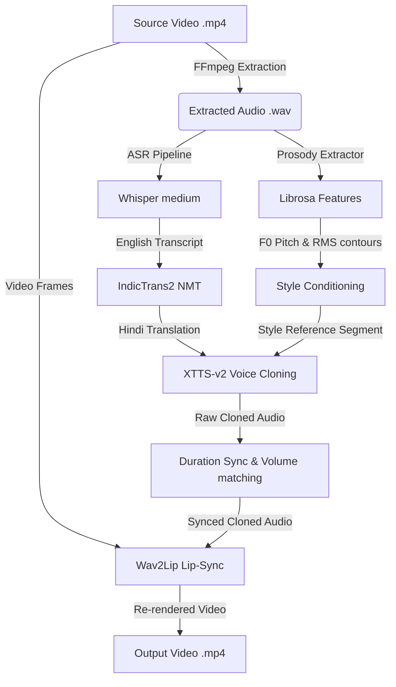

# Vaani — System Design & Architecture Document

This document presents the detailed architectural design, data flow, component breakdown, and engineering decisions for **Vaani**, an emotion-preserving AI video dubbing and voice-cloned translation pipeline (English to Hindi).

---

## 1. High-Level Architecture Overview

Vaani is designed as a sequential multi-stage pipeline where each model runs independently to avoid VRAM over-allocation. The orchestrator manages the loading and unloading of model weights in CPU/GPU memory, ensuring compatibility with free-tier cloud GPUs (e.g. 15GB VRAM limit).

---

## 2. Component Design & Responsibilities

### Component 1: Audio Extraction & Transcription (ASR)
- **Technology**: OpenAI Whisper (`medium` model)
- **Role**: Slices audio from the source video using FFmpeg and performs robust transcription with word-level timestamps.
- **VRAM profile**: ~1.5 GB VRAM.

### Component 2: Translation (NMT)
- **Technology**: AI4Bharat's `IndicTrans2-1B`
- **Role**: Translates the transcribed English text into grammatical, context-aware Hindi (Devanagari script). 
- **Design Decision**: IndicTrans2 was chosen over generic models (like NLLB-200) due to its specialized training and superior BLEU/chrF score on Indic languages.
- **VRAM profile**: ~4.0 GB VRAM.

### Component 3: Prosody Extraction & Conditioning
- **Technology**: Librosa, Soundfile, and FFmpeg
- **Role**:
  1. **Acoustic Profiling**: Extracts Pitch (F0) contours and loudness (RMS energy) from the original voice.
  2. **Zero-Shot Style Transfer**: Slices the original audio's active voice segment to use as a style-reference latent representation for the generator.
  3. **Loudness Correction**: Applies an FFmpeg volume scaler filter matching the synthesis output's RMS energy with the source profile.
  
### Component 4: Voice Cloning & Speech Synthesis (TTS)
- **Technology**: Coqui XTTS-v2 (Zero-shot voice cloning)
- **Role**: Generates natural Hindi speech in the speaker's original voice using the style-reference audio segment.
- **VRAM profile**: ~4.5 GB VRAM.

### Component 5: Audio-Video Synchronization (Sync Layer)
- **Technology**: FFmpeg dynamic filter chains
- **Role**: Measures speech duration differences. If Hindi synthesis is longer/shorter, it chains `atempo` filters (e.g. `atempo=0.5,atempo=0.5,atempo=0.6` for slow rates) to warp audio duration to match the video frame length without introducing digital pitch distortion.

### Component 6: Lip Synchronization (Lip-Sync)
- **Technology**: Wav2Lip + GAN checkpoint
- **Role**: Feeds the original video frames and the synced cloned audio into a generator that morphs the lip region to match the synthesized speech.
- **VRAM profile**: ~2.0 GB VRAM.

---

## 3. Data Flow & Orchestrator Lifecycles

The pipeline is coordinated sequentially by `vaani.pipeline.dub_video()`. To run within standard memory footprints, it utilizes a load-on-demand strategy:

1. **Audio Stage**: Extract source audio $\rightarrow$ Free memory.
2. **ASR Stage**: Load Whisper $\rightarrow$ Transcribe $\rightarrow$ Unload Whisper $\rightarrow$ Free VRAM (`torch.cuda.empty_cache()`).
3. **NMT Stage**: Load IndicTrans2 $\rightarrow$ Translate $\rightarrow$ Unload IndicTrans2 $\rightarrow$ Free VRAM.
4. **TTS Stage**: Load XTTS-v2 $\rightarrow$ Synthesize cloned audio $\rightarrow$ Unload XTTS-v2 $\rightarrow$ Free VRAM.
5. **Sync Stage**: Apply FFmpeg atempo / volume matching filters.
6. **Vision Stage**: Load Wav2Lip $\rightarrow$ Lip-sync video frames $\rightarrow$ Export final `.mp4` $\rightarrow$ Unload Wav2Lip.

---

## 4. Key Architectural Resiliencies

- **Checkpoint Resumption**: If a cloud connection drops (e.g. Google Colab session disconnects), the orchestrator scans the checkpoint directory. Completed steps (ASR, Translation, Voice Cloning) are skipped, resuming from the first uncompleted step.
- **CPU Mocks for local testing**: Heavy model packages are lazy-loaded. If run on a CPU/development machine, the system falls back to test mocks allowing developers to run integration verification locally.
